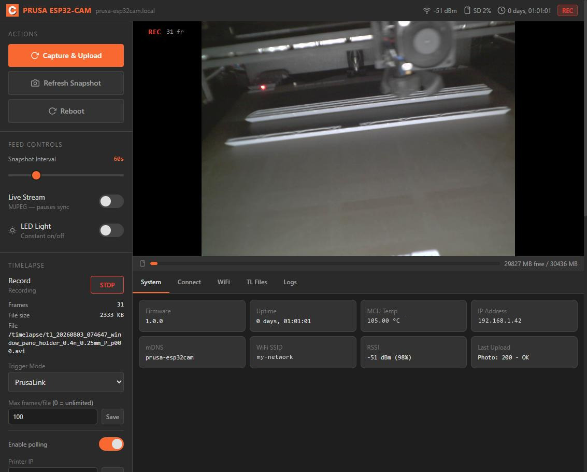
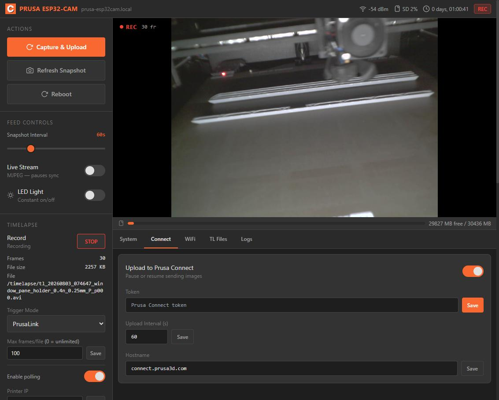
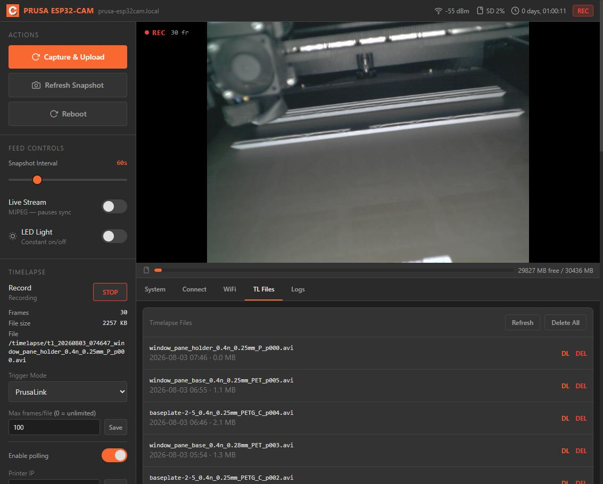

# PrusaConnect ESP32-CAM — Enhanced

A fork of [prusa3d/Prusa-Firmware-ESP32-Cam](https://github.com/prusa3d/Prusa-Firmware-ESP32-Cam)
that fixes the upload reliability problems and adds on-device timelapse video,
recorded one frame per layer.

Everything below was diagnosed and verified on real hardware — an AI Thinker
ESP32-CAM with an OV3660 at 1600×1200, uploading to Prusa Connect.

---

## Why this fork exists

The stock firmware rebooted roughly once per upload cycle and frequently reported
`INCOMPLETE DATA SEND TO SERVER`. That turned out to be several independent bugs:

| problem | cause |
|---|---|
| Panic on ~every upload | The mbedTLS allocator preferred internal RAM, starving the ~90-byte mutex the crypto hardware lock allocates lazily. `lock_init_generic()` answers a failed allocation with `abort()`. |
| `INCOMPLETE DATA SEND` | A 10 s body-write budget sitting *below* the 30 s TLS socket timeout, so a stalled write aborted mid-JPEG. |
| Uploads never retried | Retries were gated on `RefreshInterval >= 120 s` against a 30 s default. They never ran. |
| Successful uploads logged as failures | The response loop exited when the peer closed, discarding an unread `204`. |
| Reboot on any WiFi hiccup | A single `ESP.restart()` after 60 s without STA. |
| Large downloads died at ~5 min | The service-AP timeout called `WiFi.begin()` on an already-associated STA, forcing a re-association that dropped every socket. |

After the fixes: **531 consecutive uploads, zero failures, zero reboots** across a
9-hour soak, with free heap flat throughout.

---

## What's new

**Timelapse video, which the stock firmware does not do at all.** Upstream has a
setting called timelapse, but all it does is drop individual JPEGs onto the SD card —
assembling them into something watchable is left to you, on a computer, afterwards.
This fork records **MJPEG-in-AVI on the device**, finalised and playable as soon as
the print ends, with a file list you can download from.

**Per-layer capture.** One frame per detected layer, using `printer.axis_z` from
PrusaLink instead of a fixed interval. Z-hop is rejected by requiring two consecutive
polls to agree on a height, rather than by thresholding magnitude. Measured
**97 % of layers captured** (660 of 678) on a 3.5-hour print.

**Layer-height detection.** From `file.meta.layer_height`, falling back to parsing the
slicer's filename — which is the path that actually runs, because PrusaLink omits that
metadata for `.bgcode`. Drives an automatic capture-ratio report at the end of a print.

**Resumable downloads.** HTTP Range / `206 Partial Content`, implemented by hand since
ESPAsyncWebServer hardcodes `Accept-Ranges: none`. An interrupted 43 MB transfer
resumes instead of restarting.

**On-demand OTA.** A *Check for update* button on the System tab. Deliberately not a
poller — see [`src/ota.h`](src/ota.h) for why the previous 30 s poll was harmful.

**Useful filenames.** `tl_20260802_143000_cone_mount_0.25mm_p001.avi` rather than a
bare timestamp, with the file list sorted by modification time.

**A UI that works without internet.** The stock page pulled Tailwind from a CDN, so
it rendered unstyled whenever the device couldn't reach the internet — including on
its own setup access point, which is exactly where you type your WiFi password. The
stylesheet is now built ahead of time and served from flash. Costs 3.9 KB.

Also: 8 FreeRTOS tasks reduced to 3 (~9.8 KB DRAM freed), the web UI gzipped and the
unreachable upstream multi-page UI deleted (~74 KB flash freed net), upload-health
counters and stack high-water marks in telemetry.

---

## Flashing

### Browser

Open the [web flasher](https://gw-tan.github.io/Prusa-ESP32-Cam-Enhanced/)
in Chrome or Edge, pick your board and click install. Firefox and Safari don't
implement WebSerial.

### Command line

Releases carry one pair of images per board — `ai_thinker` and `wrover`. Flashing
the wrong one gives you a device with the wrong camera pins.

```bash
# New device or clean reinstall — CLEARS your settings
esptool.py --chip esp32 write_flash 0x0 firmware-ai_thinker.factory.bin

# Upgrading an existing install — KEEPS your settings
esptool.py --chip esp32 write_flash 0x10000 firmware-ai_thinker.app.bin
```

> **The factory image clears WiFi credentials and your Prusa Connect token.** It is a
> contiguous image from `0x0`, so the padding between partitions gets written too —
> including the NVS region where they live. Use the app-only image at `0x10000` to
> upgrade without losing settings. OTA never has this problem: it writes the inactive
> app partition only.

### Flash mode

The AI Thinker ESP32-CAM has no USB port. With a USB–serial adapter: connect `GPIO0`
to `GND`, power on or reset, and remove the jumper afterwards. The Freenove
WROVER board has its own USB port; if it doesn't enter the bootloader by itself,
hold `BOOT` while tapping `RESET`.

---

## Building

```bash
pio run -e ai_thinker              # build
pio run -e ai_thinker -t upload    # build and flash
pio device monitor -b 115200       # serial console
```

The environment selects the board — there is no default and no header to edit.
Building without one fails rather than guessing.

`tools/devflash.py` wraps the erase/flash/restore cycle and backs your config up
first, so testing a from-scratch install doesn't cost you the setup wizard:

```bash
python tools/devflash.py backup           # save config
python tools/devflash.py fresh --virgin   # wipe + flash, nothing restored
python tools/devflash.py upgrade          # app only, settings kept
python tools/devflash.py restore          # put config back
```

Editing the web UI means regenerating the compressed assets:

```bash
cd webpage && python webpage_gz_generator.py
```

If you added or removed a Tailwind class, rebuild the stylesheet first — that step
needs Node, and only that step:

```bash
cd webpage && npm ci && npm run build
```

`webpage/index.html` and `webpage/tailwind.src.css` are the sources of truth;
`webpage/styles.css` and `src/WebPage_gz.h` are generated — don't edit those. CI
fails the build if either is stale.

See [CONTRIBUTING.md](CONTRIBUTING.md) before opening a PR. If you own one of the
untested boards, a report either way is the most useful thing you can send.

---

## Board support

| Board | Environment | Released | Tested on hardware |
|---|---|---|---|
| AI Thinker ESP32-CAM | `ai_thinker` | yes | yes |
| Freenove ESP32-WROVER-DEV (v3.0) | `wrover` | yes | **no** |
| ESP32-S3 variants (4 envs) | see `platformio.ini` | no | no |

The **AI Thinker ESP32-CAM** is what this firmware is developed against.

The **WROVER** build is published because it was asked for, and has **not been run
on real hardware** by the maintainer. Reports welcome.

Two board-specific notes, both forced by the hardware:

- **SD card works on v3.0 boards**, which carry a microSD slot on the back wired
  to a fixed 1-bit SDMMC bus (CLK 14, CMD 15, D0 2). Earlier revisions had no
  slot; those report "No card detected" and everything else runs normally.
- **The status LED is disabled on this board.** Its only onboard LED is GPIO 2,
  which is also SD D0 — Freenove's own Blink and SDMMC examples use that one pin
  for both. Blinking it would corrupt card transfers, so the card wins and WiFi
  state is read from the web UI instead. For the same reason the factory-reset
  indicator and the optional external flash LED moved to GPIO 13.

The **ESP32-S3** environments are inherited from upstream and compile, but none has
been verified against this firmware's camera and PSRAM changes and no binaries are
published for them. Their OTA asset names are declared, so if a build is ever added
those devices start updating on their own; until then OTA tells them the asset is
missing rather than installing another board's image.

Adding a board to the release means adding it to the `build` matrix in
`.github/workflows/release.yml`, adding `docs/manifest-<env>.json`, and adding an
option to the picker in `docs/index.html`. The `OTA_ASSET_NAME` in that board's
`src/module_<board>.h` must equal `firmware-<env>.app.bin`; CI checks that.

---

## Getting started

### 1. Join your WiFi

After flashing, the camera raises an access point called `ESP32_camera_*`. Connect a
phone or laptop to it and open **http://192.168.0.1**, then enter your WiFi details.

Once it joins your network it is reachable at **http://prusa-esp32cam.local** (or by
IP — the System tab shows it).

### 2. The dashboard



The left column is controls, the right is the camera and status tabs.

- **Capture & Upload** — take a photo and send it to Prusa Connect immediately
- **Snapshot Interval** — how often it uploads automatically (10–240 s)
- **Live Stream** — MJPEG preview. Pauses automatic uploads while it's on
- **LED Light** — the on-board flash LED, constant on/off

The **System** tab shows firmware version, uptime, IP, signal strength, and the result
of the last upload — `Photo: 200 - OK` means Prusa Connect accepted it.

### 3. Connect to Prusa Connect



In Prusa Connect, add a camera and copy the token it gives you. Paste it into
**Connect → Token** and press Save. Images start appearing within one interval.

The toggle at the top right pauses uploading without losing the token.

### 4. Timelapse

Set **Trigger Mode** in the left column:

| Mode | Behaviour |
|---|---|
| **Manual** | Start and stop recording yourself, from the UI or the board button |
| **PrusaLink** | Starts and stops automatically with the print job |

For PrusaLink mode, enable polling and enter your printer's IP and API key
(Settings → Network → PrusaLink on the printer). The camera then also captures
**one frame per layer** rather than on a timer, which is what makes the resulting
video smooth.

**The flash LED tells you what happened.** Recording is otherwise silent, and the
board button gives no feedback of its own:

| Flash | Meaning |
|---|---|
| **2 slow** | Recording started — the file is open |
| **3 quick** | Recording stopped and the file was finalised |
| **nothing on stop** | Finalising failed; the file may not be playable. Check the Logs tab |

That applies however the recording was triggered — the board button, the web UI, or
PrusaLink starting and stopping it with the print job — so a glance at the camera
tells you a button press took effect without opening the UI. If the LED Light toggle
was on, it is restored afterwards.

**Right after boot the start flash can lag by up to a minute.** A recording is only
opened once the clock and the print job name are known, because both are baked into
the filename and cannot be added later. Until then the start is held, not dropped, and
the flash fires when the file actually opens. Press the button, see nothing, and the
recording is still coming — the Logs tab says `start deferred` with the reason.

`Max frames/file` splits the recording into parts. **Leave this at 100 rather than 0**
— an AVI is only playable once finalised, so with splitting disabled a power cut
loses the entire recording instead of the last segment.

### 5. Getting your videos



The **TL Files** tab lists recordings newest-first, named after the print, with date
and size. **DL** downloads, **DEL** deletes.

Downloads are resumable — if one is interrupted, your browser picks up where it left
off rather than restarting.

### 6. Updating

**System → Firmware update → Check for update.** Nothing is downloaded or installed
until you press the button; there is no background polling. If a newer release exists,
an **Install** button appears, then **Reboot now** once it's written.

OTA updates never touch your settings — they write the inactive app partition only.

---

## Security

The web UI is plain HTTP with authentication off by default, so anything on your
network can reach the stream, the settings and the SD card. **Keep it on a trusted
LAN and don't port-forward it.** [SECURITY.md](SECURITY.md) covers what the firmware
assumes and how to report a vulnerability.

---

## Licence and attribution

GPL-3.0, inherited from the upstream project.

This is a **modified version** of
[prusa3d/Prusa-Firmware-ESP32-Cam](https://github.com/prusa3d/Prusa-Firmware-ESP32-Cam),
originally written by Miroslav Pivovarsky for Prusa Research. Modified from
May 2026 onward; the upload path, task model, web UI, OTA and timelapse differ
substantially from upstream. Complete corresponding source for every
release is this repository.

Exif generation is by David Imhoff, under the BSD 3-clause licence — see the
headers in [`src/exif.h`](src/exif.h).

### Not a Prusa product

**This project is not affiliated with, endorsed by, or supported by Prusa
Research.** "Prusa", "Prusa Connect" and "PrusaLink" are trademarks of Prusa
Research a.s., used here only to describe what this firmware interoperates with.
Do not report problems with this firmware to Prusa — open an issue here instead.

The firmware ships none of Prusa's artwork. GPL grants copyright permissions, not
trademark rights, so the upstream favicon (Prusa Connect's own logo mark) was
replaced with a plain camera glyph drawn for this fork.
